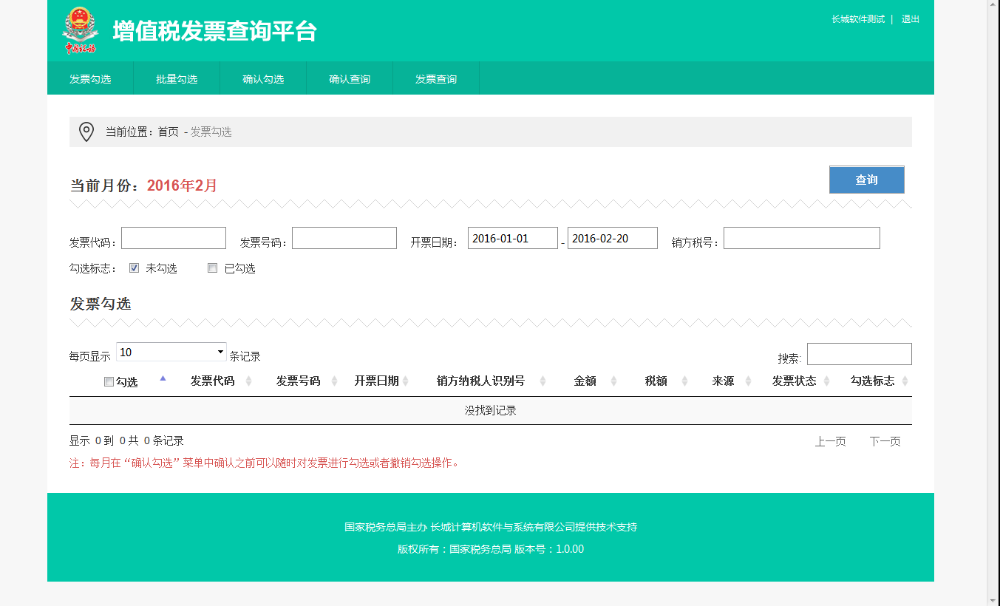

##增值税发票查询平台轻松用

一、登录

1、在电脑上连接好金税盘或税控盘，然后使用IE浏览器（建议IE8以上的浏览器体验更佳）登录系统[https://fpdk.sd-n-tax.gov.cn/](https://fpdk.sd-n-tax.gov.cn/)

2、首次登录系统可能会出现如下提示警告，需要点击“继续浏览此网站”的链接。

3、此时浏览器可以正确显示出增值税发票查询平台的登录页面，然后点击“请下载驱动程序和安全控件”的链接，将driver_control.rar压缩包下载至本地硬盘进行安装。

4、输入金税盘或税控盘的密码后点击“登录”按钮即可。

二、勾选

1、在功能界面中，根据需要输入或选择相关查询条件，然后点击“查询”按钮；

2、系统自动返回相关的查询结果信息，用户可以根据需要选择发票进行勾选操作，确认本次需要勾选的发票全部勾选完成后，可以点击“保存”按钮，即可将本次勾选的操作进行保存处理（未执行确认勾选操作前，可以对来源于底账系统的发票进行取消勾选的回退处理）。

3、如果发票数据量较大，可以通过文件导入的形式实现批量勾选。

三、确认

1、点击”确认勾选“菜单，系统会自动连接局端后台系统实时统计出本月已勾选的发票汇总情况，如果确认次月征收期内要申报抵扣（或退税）的所有发票均已完成勾选，则点击“确定”按钮。

2、当月勾选确认操作完成后，勾选确认功能菜单即自动锁定不可再重复进入。

3、每月月底前，对当月已勾选的发票，在“勾选确认”功能中进行一次确认操作（若用户没有确认，则系统会在每月最后1日的22点进行自动确认）。

四、抵扣

纳税人当期可用于申报抵扣或者出口退税的增值税发票，包括纳税人已确认勾选和扫描认证的发票。
